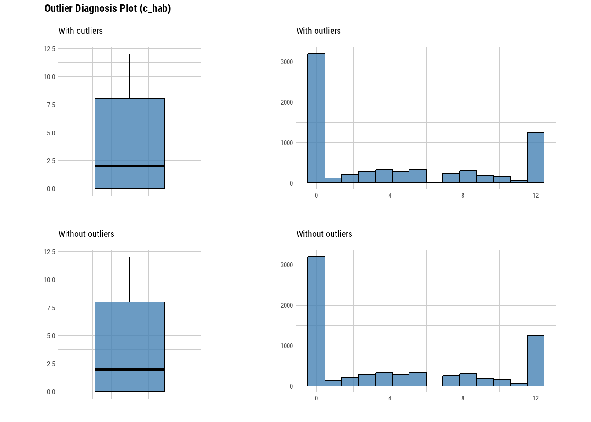
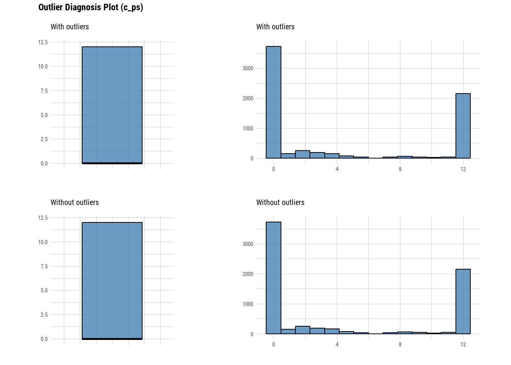
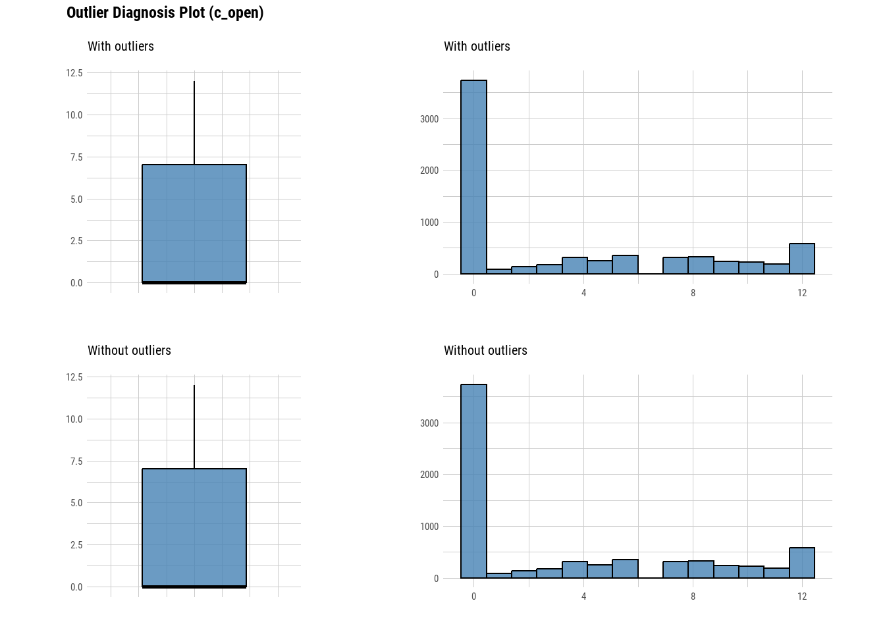
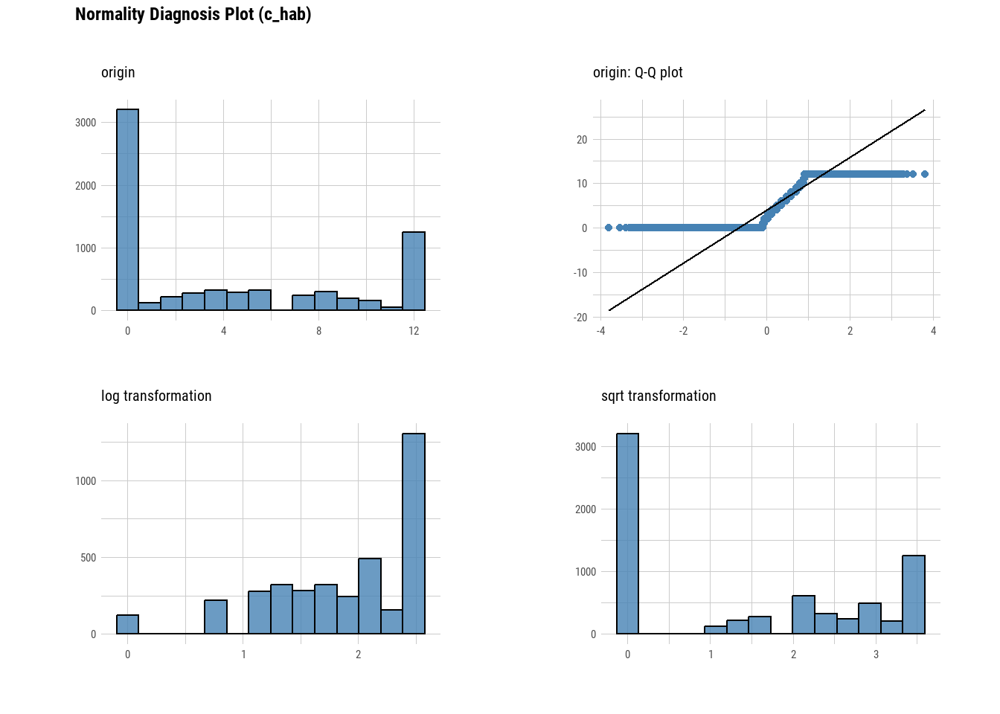
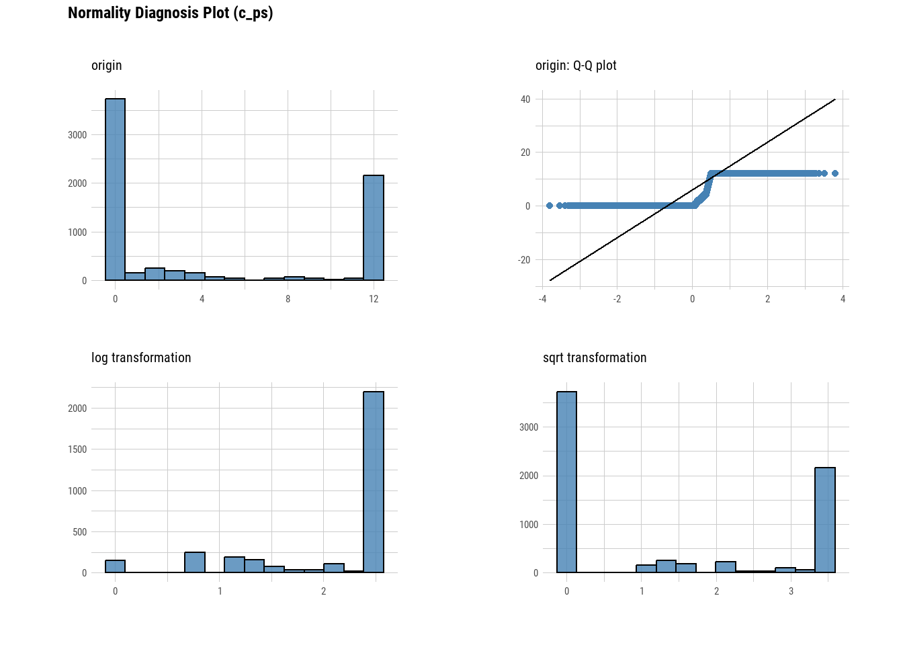
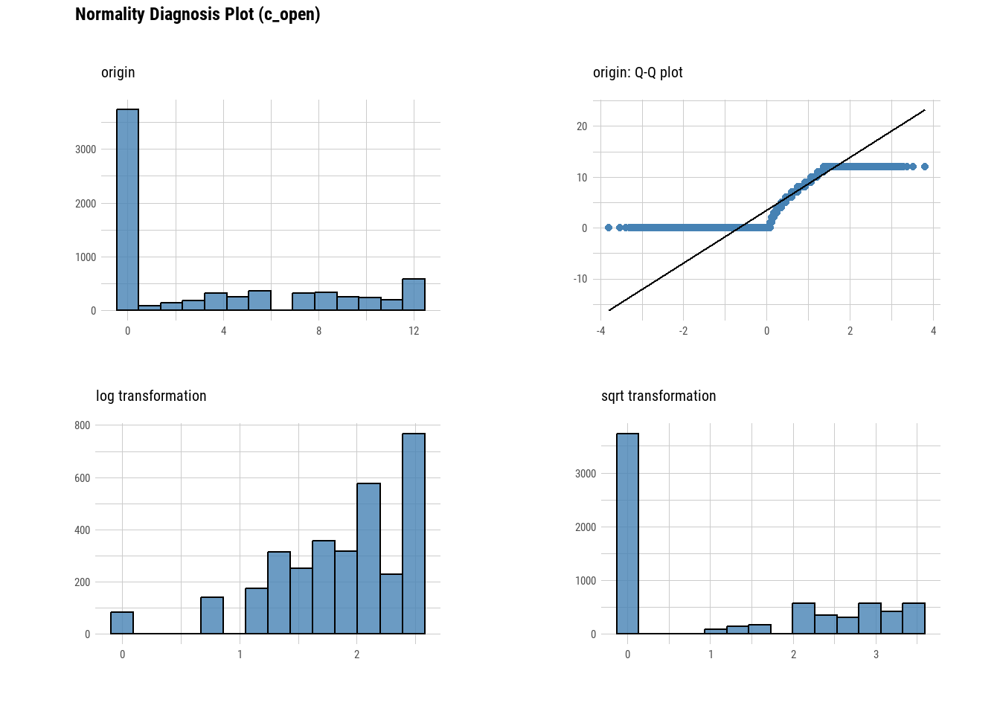

This is a self-contained data analysis report for REC-22-436_REST_ECO_MANUSCRIPT_REV1.

##### Required libraries


```r
library(tidyverse)
library(knitr)
library(kableExtra)
library(funModeling)
library(dlookr)
library(glmmTMB)
library(ggeffects)
library(DHARMa)
library(ggpubr)
```

# 1. Load & prepare data

roach_wide.csv - wide data set where fish counts are stored in columns c_hab, c_open, c_ps


```r
roach_wide=read_csv("./data/roach_wide.csv")
```

## 1.1 Data discovery

Determine dataset structure by checking number of rows, columns and data types (i.e., numerical, factors). Identify categorical factors and their levels.


```r
nrow(roach_wide)
```

```
## [1] 6942
```

```r
ncol(roach_wide)
```

```
## [1] 24
```

```r
colnames(roach_wide)
```

```
##  [1] "date"          "time"          "run"           "trial"        
##  [5] "treatment"     "ps_tank_end"   "room_end"      "tank"         
##  [9] "light"         "sequence"      "day"           "seq_day"      
## [13] "hab_avail"     "ps_avail"      "both_avail"    "hours_havail" 
## [17] "hours_lout"    "c_hab"         "c_open_screen" "c_open_cent"  
## [21] "c_open_hab"    "c_open"        "c_ps"          "c_both"
```

funModeling:df_status - For each variable it returns: Quantity and percentage of zeros (q_zeros and p_zeros respectively). Same metrics for NA values (q_NA/p_na), and infinite values (q_inf/p_inf). Last two columns indicates data type and quantity of unique values.


```r
roach_wide_status<- funModeling::df_status(roach_wide, print_results = F)
```

<table class="table table-striped table-hover table-condensed" style="width: auto !important; margin-left: auto; margin-right: auto;">
 <thead>
  <tr>
   <th style="text-align:left;"> variable </th>
   <th style="text-align:right;"> q_zeros </th>
   <th style="text-align:right;"> p_zeros </th>
   <th style="text-align:right;"> q_na </th>
   <th style="text-align:right;"> p_na </th>
   <th style="text-align:right;"> q_inf </th>
   <th style="text-align:right;"> p_inf </th>
   <th style="text-align:left;"> type </th>
   <th style="text-align:right;"> unique </th>
  </tr>
 </thead>
<tbody>
  <tr>
   <td style="text-align:left;"> date </td>
   <td style="text-align:right;"> 0 </td>
   <td style="text-align:right;"> 0.00 </td>
   <td style="text-align:right;"> 0 </td>
   <td style="text-align:right;"> 0.00 </td>
   <td style="text-align:right;"> 0 </td>
   <td style="text-align:right;"> 0 </td>
   <td style="text-align:left;"> character </td>
   <td style="text-align:right;"> 52 </td>
  </tr>
  <tr>
   <td style="text-align:left;"> time </td>
   <td style="text-align:right;"> 288 </td>
   <td style="text-align:right;"> 4.15 </td>
   <td style="text-align:right;"> 0 </td>
   <td style="text-align:right;"> 0.00 </td>
   <td style="text-align:right;"> 0 </td>
   <td style="text-align:right;"> 0 </td>
   <td style="text-align:left;"> hms-difftime </td>
   <td style="text-align:right;"> 24 </td>
  </tr>
  <tr>
   <td style="text-align:left;"> run </td>
   <td style="text-align:right;"> 0 </td>
   <td style="text-align:right;"> 0.00 </td>
   <td style="text-align:right;"> 0 </td>
   <td style="text-align:right;"> 0.00 </td>
   <td style="text-align:right;"> 0 </td>
   <td style="text-align:right;"> 0 </td>
   <td style="text-align:left;"> numeric </td>
   <td style="text-align:right;"> 4 </td>
  </tr>
  <tr>
   <td style="text-align:left;"> trial </td>
   <td style="text-align:right;"> 0 </td>
   <td style="text-align:right;"> 0.00 </td>
   <td style="text-align:right;"> 0 </td>
   <td style="text-align:right;"> 0.00 </td>
   <td style="text-align:right;"> 0 </td>
   <td style="text-align:right;"> 0 </td>
   <td style="text-align:left;"> numeric </td>
   <td style="text-align:right;"> 24 </td>
  </tr>
  <tr>
   <td style="text-align:left;"> treatment </td>
   <td style="text-align:right;"> 3471 </td>
   <td style="text-align:right;"> 50.00 </td>
   <td style="text-align:right;"> 0 </td>
   <td style="text-align:right;"> 0.00 </td>
   <td style="text-align:right;"> 0 </td>
   <td style="text-align:right;"> 0 </td>
   <td style="text-align:left;"> numeric </td>
   <td style="text-align:right;"> 2 </td>
  </tr>
  <tr>
   <td style="text-align:left;"> ps_tank_end </td>
   <td style="text-align:right;"> 3468 </td>
   <td style="text-align:right;"> 49.96 </td>
   <td style="text-align:right;"> 0 </td>
   <td style="text-align:right;"> 0.00 </td>
   <td style="text-align:right;"> 0 </td>
   <td style="text-align:right;"> 0 </td>
   <td style="text-align:left;"> numeric </td>
   <td style="text-align:right;"> 2 </td>
  </tr>
  <tr>
   <td style="text-align:left;"> room_end </td>
   <td style="text-align:right;"> 3471 </td>
   <td style="text-align:right;"> 50.00 </td>
   <td style="text-align:right;"> 0 </td>
   <td style="text-align:right;"> 0.00 </td>
   <td style="text-align:right;"> 0 </td>
   <td style="text-align:right;"> 0 </td>
   <td style="text-align:left;"> numeric </td>
   <td style="text-align:right;"> 2 </td>
  </tr>
  <tr>
   <td style="text-align:left;"> tank </td>
   <td style="text-align:right;"> 0 </td>
   <td style="text-align:right;"> 0.00 </td>
   <td style="text-align:right;"> 0 </td>
   <td style="text-align:right;"> 0.00 </td>
   <td style="text-align:right;"> 0 </td>
   <td style="text-align:right;"> 0 </td>
   <td style="text-align:left;"> numeric </td>
   <td style="text-align:right;"> 6 </td>
  </tr>
  <tr>
   <td style="text-align:left;"> light </td>
   <td style="text-align:right;"> 2616 </td>
   <td style="text-align:right;"> 37.68 </td>
   <td style="text-align:right;"> 0 </td>
   <td style="text-align:right;"> 0.00 </td>
   <td style="text-align:right;"> 0 </td>
   <td style="text-align:right;"> 0 </td>
   <td style="text-align:left;"> numeric </td>
   <td style="text-align:right;"> 2 </td>
  </tr>
  <tr>
   <td style="text-align:left;"> sequence </td>
   <td style="text-align:right;"> 0 </td>
   <td style="text-align:right;"> 0.00 </td>
   <td style="text-align:right;"> 0 </td>
   <td style="text-align:right;"> 0.00 </td>
   <td style="text-align:right;"> 0 </td>
   <td style="text-align:right;"> 0 </td>
   <td style="text-align:left;"> numeric </td>
   <td style="text-align:right;"> 4 </td>
  </tr>
  <tr>
   <td style="text-align:left;"> day </td>
   <td style="text-align:right;"> 0 </td>
   <td style="text-align:right;"> 0.00 </td>
   <td style="text-align:right;"> 0 </td>
   <td style="text-align:right;"> 0.00 </td>
   <td style="text-align:right;"> 0 </td>
   <td style="text-align:right;"> 0 </td>
   <td style="text-align:left;"> numeric </td>
   <td style="text-align:right;"> 13 </td>
  </tr>
  <tr>
   <td style="text-align:left;"> seq_day </td>
   <td style="text-align:right;"> 0 </td>
   <td style="text-align:right;"> 0.00 </td>
   <td style="text-align:right;"> 0 </td>
   <td style="text-align:right;"> 0.00 </td>
   <td style="text-align:right;"> 0 </td>
   <td style="text-align:right;"> 0 </td>
   <td style="text-align:left;"> numeric </td>
   <td style="text-align:right;"> 52 </td>
  </tr>
  <tr>
   <td style="text-align:left;"> hab_avail </td>
   <td style="text-align:right;"> 5214 </td>
   <td style="text-align:right;"> 75.11 </td>
   <td style="text-align:right;"> 0 </td>
   <td style="text-align:right;"> 0.00 </td>
   <td style="text-align:right;"> 0 </td>
   <td style="text-align:right;"> 0 </td>
   <td style="text-align:left;"> numeric </td>
   <td style="text-align:right;"> 2 </td>
  </tr>
  <tr>
   <td style="text-align:left;"> ps_avail </td>
   <td style="text-align:right;"> 5166 </td>
   <td style="text-align:right;"> 74.42 </td>
   <td style="text-align:right;"> 0 </td>
   <td style="text-align:right;"> 0.00 </td>
   <td style="text-align:right;"> 0 </td>
   <td style="text-align:right;"> 0 </td>
   <td style="text-align:left;"> numeric </td>
   <td style="text-align:right;"> 2 </td>
  </tr>
  <tr>
   <td style="text-align:left;"> both_avail </td>
   <td style="text-align:right;"> 3504 </td>
   <td style="text-align:right;"> 50.48 </td>
   <td style="text-align:right;"> 0 </td>
   <td style="text-align:right;"> 0.00 </td>
   <td style="text-align:right;"> 0 </td>
   <td style="text-align:right;"> 0 </td>
   <td style="text-align:left;"> numeric </td>
   <td style="text-align:right;"> 2 </td>
  </tr>
  <tr>
   <td style="text-align:left;"> hours_havail </td>
   <td style="text-align:right;"> 0 </td>
   <td style="text-align:right;"> 0.00 </td>
   <td style="text-align:right;"> 3516 </td>
   <td style="text-align:right;"> 50.65 </td>
   <td style="text-align:right;"> 0 </td>
   <td style="text-align:right;"> 0 </td>
   <td style="text-align:left;"> numeric </td>
   <td style="text-align:right;"> 72 </td>
  </tr>
  <tr>
   <td style="text-align:left;"> hours_lout </td>
   <td style="text-align:right;"> 288 </td>
   <td style="text-align:right;"> 4.15 </td>
   <td style="text-align:right;"> 2334 </td>
   <td style="text-align:right;"> 33.62 </td>
   <td style="text-align:right;"> 0 </td>
   <td style="text-align:right;"> 0 </td>
   <td style="text-align:left;"> numeric </td>
   <td style="text-align:right;"> 16 </td>
  </tr>
  <tr>
   <td style="text-align:left;"> c_hab </td>
   <td style="text-align:right;"> 3201 </td>
   <td style="text-align:right;"> 46.11 </td>
   <td style="text-align:right;"> 0 </td>
   <td style="text-align:right;"> 0.00 </td>
   <td style="text-align:right;"> 0 </td>
   <td style="text-align:right;"> 0 </td>
   <td style="text-align:left;"> numeric </td>
   <td style="text-align:right;"> 13 </td>
  </tr>
  <tr>
   <td style="text-align:left;"> c_open_screen </td>
   <td style="text-align:right;"> 5683 </td>
   <td style="text-align:right;"> 81.86 </td>
   <td style="text-align:right;"> 0 </td>
   <td style="text-align:right;"> 0.00 </td>
   <td style="text-align:right;"> 0 </td>
   <td style="text-align:right;"> 0 </td>
   <td style="text-align:left;"> numeric </td>
   <td style="text-align:right;"> 13 </td>
  </tr>
  <tr>
   <td style="text-align:left;"> c_open_cent </td>
   <td style="text-align:right;"> 5331 </td>
   <td style="text-align:right;"> 76.79 </td>
   <td style="text-align:right;"> 0 </td>
   <td style="text-align:right;"> 0.00 </td>
   <td style="text-align:right;"> 0 </td>
   <td style="text-align:right;"> 0 </td>
   <td style="text-align:left;"> numeric </td>
   <td style="text-align:right;"> 13 </td>
  </tr>
  <tr>
   <td style="text-align:left;"> c_open_hab </td>
   <td style="text-align:right;"> 4510 </td>
   <td style="text-align:right;"> 64.97 </td>
   <td style="text-align:right;"> 0 </td>
   <td style="text-align:right;"> 0.00 </td>
   <td style="text-align:right;"> 0 </td>
   <td style="text-align:right;"> 0 </td>
   <td style="text-align:left;"> numeric </td>
   <td style="text-align:right;"> 13 </td>
  </tr>
  <tr>
   <td style="text-align:left;"> c_open </td>
   <td style="text-align:right;"> 3732 </td>
   <td style="text-align:right;"> 53.76 </td>
   <td style="text-align:right;"> 0 </td>
   <td style="text-align:right;"> 0.00 </td>
   <td style="text-align:right;"> 0 </td>
   <td style="text-align:right;"> 0 </td>
   <td style="text-align:left;"> numeric </td>
   <td style="text-align:right;"> 13 </td>
  </tr>
  <tr>
   <td style="text-align:left;"> c_ps </td>
   <td style="text-align:right;"> 3724 </td>
   <td style="text-align:right;"> 53.64 </td>
   <td style="text-align:right;"> 0 </td>
   <td style="text-align:right;"> 0.00 </td>
   <td style="text-align:right;"> 0 </td>
   <td style="text-align:right;"> 0 </td>
   <td style="text-align:left;"> numeric </td>
   <td style="text-align:right;"> 13 </td>
  </tr>
  <tr>
   <td style="text-align:left;"> c_both </td>
   <td style="text-align:right;"> 599 </td>
   <td style="text-align:right;"> 8.63 </td>
   <td style="text-align:right;"> 0 </td>
   <td style="text-align:right;"> 0.00 </td>
   <td style="text-align:right;"> 0 </td>
   <td style="text-align:right;"> 0 </td>
   <td style="text-align:left;"> numeric </td>
   <td style="text-align:right;"> 13 </td>
  </tr>
</tbody>
</table>

Several variables need to be converted to factors and labels added to levels.

### 1.1.1 Set factors and add labels

Create a lookup table for variable labels.


```r
labels_table <- list(
  treatment = c('Covered (B)','Uncovered (A)'),
  ps_tank_end = c('RH', 'LH'),
  room_end = c('Far', 'Near'),
  light = c('Day', 'Night'),
  hab_avail = c('AH unavailable', 'AH available'),
  ps_avail = c('PS available','PS unavailable'),
  both_avail = c('Single Available', 'Both Available'),
  sequence = c('Baseline', 'I 1', 'I 2', 'I 3')
)
```

Convert variables to factors with specific labeling using a loop. Use the lookup table to get the labels for each variable.


```r
for (var in names(labels_table)) {
  levels <- unique(roach_wide[[var]])
  labels <- labels_table[[var]]
  roach_wide[[var]] <- factor(roach_wide[[var]], levels = levels, labels = labels)
}
```

Convert other variables to factors without adding labels.


```r
other_vars <- c("hours_havail", "hours_lout", "run", "day", "trial")
roach_wide[other_vars] <- lapply(roach_wide[other_vars], as.factor)
```

## 1.2 Data diagnosis

### 1.2.1 NAs

Using the roach_wide_status dataframe consider variables with NA values.


```r
roach_na <- roach_wide_status %>%
  filter(q_na > 0) %>%
  arrange(-p_na) %>%
  select(variable, q_na, p_na)
```

<table class="table table-striped table-hover table-condensed" style="width: auto !important; margin-left: auto; margin-right: auto;">
 <thead>
  <tr>
   <th style="text-align:left;"> variable </th>
   <th style="text-align:right;"> q_na </th>
   <th style="text-align:right;"> p_na </th>
  </tr>
 </thead>
<tbody>
  <tr>
   <td style="text-align:left;"> hours_havail </td>
   <td style="text-align:right;"> 3516 </td>
   <td style="text-align:right;"> 50.65 </td>
  </tr>
  <tr>
   <td style="text-align:left;"> hours_lout </td>
   <td style="text-align:right;"> 2334 </td>
   <td style="text-align:right;"> 33.62 </td>
  </tr>
</tbody>
</table>

Variables with NA not considered in main analysis, NAs can be omitted for visual analysis.

### 1.2.2 0's

Using the roach_wide_status dataframe consider the spread of zeros in habitat count variables


```r
roach_0 <- roach_wide_status %>%
  filter(variable %in% c("c_hab", "c_ps", "c_open", "c_open_cent", "c_open_screen", "c_open_hab")) %>%
  arrange(-p_zeros) %>%
  select(variable, q_zeros, p_zeros)
```

<table class="table table-striped table-hover table-condensed" style="width: auto !important; margin-left: auto; margin-right: auto;">
 <thead>
  <tr>
   <th style="text-align:left;"> variable </th>
   <th style="text-align:right;"> q_zeros </th>
   <th style="text-align:right;"> p_zeros </th>
  </tr>
 </thead>
<tbody>
  <tr>
   <td style="text-align:left;"> c_open_screen </td>
   <td style="text-align:right;"> 5683 </td>
   <td style="text-align:right;"> 81.86 </td>
  </tr>
  <tr>
   <td style="text-align:left;"> c_open_cent </td>
   <td style="text-align:right;"> 5331 </td>
   <td style="text-align:right;"> 76.79 </td>
  </tr>
  <tr>
   <td style="text-align:left;"> c_open_hab </td>
   <td style="text-align:right;"> 4510 </td>
   <td style="text-align:right;"> 64.97 </td>
  </tr>
  <tr>
   <td style="text-align:left;"> c_open </td>
   <td style="text-align:right;"> 3732 </td>
   <td style="text-align:right;"> 53.76 </td>
  </tr>
  <tr>
   <td style="text-align:left;"> c_ps </td>
   <td style="text-align:right;"> 3724 </td>
   <td style="text-align:right;"> 53.64 </td>
  </tr>
  <tr>
   <td style="text-align:left;"> c_hab </td>
   <td style="text-align:right;"> 3201 </td>
   <td style="text-align:right;"> 46.11 </td>
  </tr>
</tbody>
</table>

High proportion of 0's in all counts, but will be confounded without consideration for light period and habitat availability. Regardless, the presence of high 0's will significantly skew variability and make raw counts hard to interpret. Descriptive statistics would be limited by high IQR and misleading min/max values. Consider rescaling count variables for analysis.

### 1.2.3 Outliers

Check the main dataframe for outliers.

dlookr::plot_outlier - for each variable specified the function plots outlier information for numerical data diagnosis


```r
dlookr::plot_outlier(roach_wide, "c_hab", "c_ps", "c_open")
```



### 1.2.4 Normality

Check the main dataframe for data distribution.

dlookr::plot_normality - for each variable specified the function determines normality by plotting histogram and q-q plot of the original data, log transformed, and square root transformed.


```r
dlookr::plot_normality(roach_wide, "c_hab", "c_ps", "c_open")
```



## 1.3 Rescale count data

The code performs a two-step transformation: it first normalizes raw fish count data to a 0-1 scale, and then ensures that the normalized values have a small positive offset to prevent division by zero issues for modelling.


```r
roach_wide <- roach_wide %>%
  mutate(across(c(c_hab, c_ps, c_open), ~ . / max(.), .names = "{.col}_normalized"),
         across(ends_with("_normalized"), ~ ifelse(. == 0, . + 0.0000000001, .)))
```

## 1.4 Summarise

First, create minimal dataset with variables of interest.


```r
roach_wide_sum = select(roach_wide, c_hab, c_ps, c_open, c_hab_normalized, c_ps_normalized, c_open_normalized, sequence, light, treatment)
```

funModeling::profile_num - Provides an expanded summary including mean, standard deviation, skewness and kurtosis. 

Skewness >0 = right-skew, <0 = left-skew, 0 = symmetric.
kurtosis >3 = sharp, <3 = flat, 3 = normal


```r
numeric_prof <-funModeling::profiling_num(roach_wide_sum)
```

<table class="table table-striped table-hover table-condensed" style="width: auto !important; margin-left: auto; margin-right: auto;">
 <thead>
  <tr>
   <th style="text-align:left;"> variable </th>
   <th style="text-align:right;"> mean </th>
   <th style="text-align:right;"> std_dev </th>
   <th style="text-align:right;"> variation_coef </th>
   <th style="text-align:right;"> p_01 </th>
   <th style="text-align:right;"> p_05 </th>
   <th style="text-align:right;"> p_25 </th>
   <th style="text-align:right;"> p_50 </th>
   <th style="text-align:right;"> p_75 </th>
   <th style="text-align:right;"> p_95 </th>
   <th style="text-align:right;"> p_99 </th>
   <th style="text-align:right;"> skewness </th>
   <th style="text-align:right;"> kurtosis </th>
   <th style="text-align:right;"> iqr </th>
   <th style="text-align:left;"> range_98 </th>
   <th style="text-align:left;"> range_80 </th>
  </tr>
 </thead>
<tbody>
  <tr>
   <td style="text-align:left;"> c_hab </td>
   <td style="text-align:right;"> 4.1780467 </td>
   <td style="text-align:right;"> 4.7238987 </td>
   <td style="text-align:right;"> 1.130648 </td>
   <td style="text-align:right;"> 0 </td>
   <td style="text-align:right;"> 0 </td>
   <td style="text-align:right;"> 0 </td>
   <td style="text-align:right;"> 2.0000000 </td>
   <td style="text-align:right;"> 8.0000000 </td>
   <td style="text-align:right;"> 12 </td>
   <td style="text-align:right;"> 12 </td>
   <td style="text-align:right;"> 0.6180048 </td>
   <td style="text-align:right;"> 1.782165 </td>
   <td style="text-align:right;"> 8.0000000 </td>
   <td style="text-align:left;"> [0, 12] </td>
   <td style="text-align:left;"> [0, 12] </td>
  </tr>
  <tr>
   <td style="text-align:left;"> c_ps </td>
   <td style="text-align:right;"> 4.3388073 </td>
   <td style="text-align:right;"> 5.4305629 </td>
   <td style="text-align:right;"> 1.251626 </td>
   <td style="text-align:right;"> 0 </td>
   <td style="text-align:right;"> 0 </td>
   <td style="text-align:right;"> 0 </td>
   <td style="text-align:right;"> 0.0000000 </td>
   <td style="text-align:right;"> 12.0000000 </td>
   <td style="text-align:right;"> 12 </td>
   <td style="text-align:right;"> 12 </td>
   <td style="text-align:right;"> 0.6121211 </td>
   <td style="text-align:right;"> 1.476341 </td>
   <td style="text-align:right;"> 12.0000000 </td>
   <td style="text-align:left;"> [0, 12] </td>
   <td style="text-align:left;"> [0, 12] </td>
  </tr>
  <tr>
   <td style="text-align:left;"> c_open </td>
   <td style="text-align:right;"> 3.4462691 </td>
   <td style="text-align:right;"> 4.3204959 </td>
   <td style="text-align:right;"> 1.253673 </td>
   <td style="text-align:right;"> 0 </td>
   <td style="text-align:right;"> 0 </td>
   <td style="text-align:right;"> 0 </td>
   <td style="text-align:right;"> 0.0000000 </td>
   <td style="text-align:right;"> 7.0000000 </td>
   <td style="text-align:right;"> 12 </td>
   <td style="text-align:right;"> 12 </td>
   <td style="text-align:right;"> 0.8004510 </td>
   <td style="text-align:right;"> 2.112379 </td>
   <td style="text-align:right;"> 7.0000000 </td>
   <td style="text-align:left;"> [0, 12] </td>
   <td style="text-align:left;"> [0, 11] </td>
  </tr>
  <tr>
   <td style="text-align:left;"> c_hab_normalized </td>
   <td style="text-align:right;"> 0.3481706 </td>
   <td style="text-align:right;"> 0.3936582 </td>
   <td style="text-align:right;"> 1.130648 </td>
   <td style="text-align:right;"> 0 </td>
   <td style="text-align:right;"> 0 </td>
   <td style="text-align:right;"> 0 </td>
   <td style="text-align:right;"> 0.1666667 </td>
   <td style="text-align:right;"> 0.6666667 </td>
   <td style="text-align:right;"> 1 </td>
   <td style="text-align:right;"> 1 </td>
   <td style="text-align:right;"> 0.6180048 </td>
   <td style="text-align:right;"> 1.782165 </td>
   <td style="text-align:right;"> 0.6666667 </td>
   <td style="text-align:left;"> [1e-10, 1] </td>
   <td style="text-align:left;"> [1e-10, 1] </td>
  </tr>
  <tr>
   <td style="text-align:left;"> c_ps_normalized </td>
   <td style="text-align:right;"> 0.3615673 </td>
   <td style="text-align:right;"> 0.4525469 </td>
   <td style="text-align:right;"> 1.251626 </td>
   <td style="text-align:right;"> 0 </td>
   <td style="text-align:right;"> 0 </td>
   <td style="text-align:right;"> 0 </td>
   <td style="text-align:right;"> 0.0000000 </td>
   <td style="text-align:right;"> 1.0000000 </td>
   <td style="text-align:right;"> 1 </td>
   <td style="text-align:right;"> 1 </td>
   <td style="text-align:right;"> 0.6121211 </td>
   <td style="text-align:right;"> 1.476341 </td>
   <td style="text-align:right;"> 1.0000000 </td>
   <td style="text-align:left;"> [1e-10, 1] </td>
   <td style="text-align:left;"> [1e-10, 1] </td>
  </tr>
  <tr>
   <td style="text-align:left;"> c_open_normalized </td>
   <td style="text-align:right;"> 0.2871891 </td>
   <td style="text-align:right;"> 0.3600413 </td>
   <td style="text-align:right;"> 1.253673 </td>
   <td style="text-align:right;"> 0 </td>
   <td style="text-align:right;"> 0 </td>
   <td style="text-align:right;"> 0 </td>
   <td style="text-align:right;"> 0.0000000 </td>
   <td style="text-align:right;"> 0.5833333 </td>
   <td style="text-align:right;"> 1 </td>
   <td style="text-align:right;"> 1 </td>
   <td style="text-align:right;"> 0.8004510 </td>
   <td style="text-align:right;"> 2.112379 </td>
   <td style="text-align:right;"> 0.5833333 </td>
   <td style="text-align:left;"> [1e-10, 1] </td>
   <td style="text-align:left;"> [1e-10, 0.916666666666667] </td>
  </tr>
</tbody>
</table>

Standard deviations of raw counts are high, as expected from normality plots.


